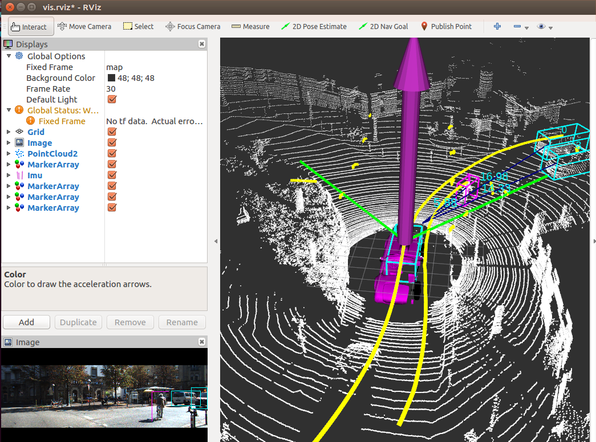

# KITTI Dataset

## demo



-   Download KITTI dataset
-   Run kitti.py

```sh
rosrun kitti_tutorial kitti.py
```

-   Visualize result use Rviz

Use "simulator/vis.rviz"

# References

## Kitti tutorial:

-   <https://github.com/kwea123/ROS_notes>
-   <https://github.com/seaside2mm/ros-kitti-project>
-   [kitii数据集的使用.ipynb](https://github.com/seaside2mm/ros-kitti-project/blob/master/kitii%E6%95%B0%E6%8D%AE%E9%9B%86%E7%9A%84%E4%BD%BF%E7%94%A8.ipynb)
